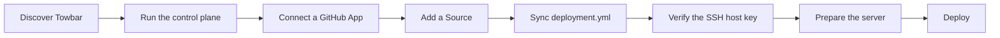

# Towbar

Towbar is an opinionated, source-driven deployment platform for Ubuntu servers
you own. A repository's `.towbar/deployment.yml` declares its apps, resources,
servers, dependencies, domains, secrets, and deployment policy. Towbar keeps the
manifest as the source of truth and runs deployments through durable Temporal
workflows.



> [!IMPORTANT]
> This repository is an early open-source extraction. Review the security and
> operational assumptions before exposing it to the public internet.

## What runs

The Compose stack builds and runs four Towbar applications:

| Service   | Purpose                                                    | Default address  |
| --------- | ---------------------------------------------------------- | ---------------- |
| `api`     | Authentication, source sync, inventory, and deployment API | `127.0.0.1:4020` |
| `worker`  | Temporal deployment and maintenance worker                 | Internal only    |
| `web-app` | Operator dashboard                                         | `127.0.0.1:4021` |
| `sso`     | Sign-in and account recovery                               | `127.0.0.1:4022` |

PostgreSQL and Temporal are foundation services. Temporal UI is available on
`127.0.0.1:8233`. Database migrations run as a one-shot job before the API.

## Quick start

For the complete operator journey, start with the
[getting-started guide](docs/getting-started.md). The short path is:

Requirements:

- Docker Engine with Compose v2
- Git
- OpenSSL for generating local secrets

```bash
git clone https://github.com/avgeek-inc/towbar.git
cd towbar
cp .env.example .env
```

Replace every placeholder in `.env`. The database and signing secrets can use
independent hex values:

```bash
openssl rand -hex 32
```

The credential-encryption key has a different format and must decode to exactly
32 bytes:

```bash
openssl rand -base64 32 | tr -d '\n'
```

Then build and start the stack:

```bash
docker compose up --build --detach --wait
```

Open `http://localhost:4021`. Towbar redirects to the first-run setup screen,
where you create the owner account. Account creation is atomically locked as
soon as that owner exists. Complete this loopback-only step before placing the
three public services behind an internet-reachable proxy.

Useful commands:

```bash
docker compose ps
docker compose logs --follow api worker
docker compose down
```

`docker compose down` preserves PostgreSQL data. Deleting the named volume is a
separate, destructive operation and is intentionally not part of Towbar's
scripts.

## Configuration boundary

`.env` configures this Towbar installation: public URLs, listener ports,
database credentials, encryption and signing keys, a GitHub App, and optional
observability providers. See [configuration](docs/configuration.md).

Deployment targets do **not** belong in `.env`. Server IPs, SSH login secret
references, apps, resources, Docker networks, and domains belong to the
connected repository's `.towbar/deployment.yml`. AWS credentials used to resolve
those references are entered per Source in the dashboard and encrypted before
storage.

## Production notes

- The default bind address is loopback. Put a maintained TLS reverse proxy in
  front of the three HTTP services and set their public base URLs before build.
- Never publish PostgreSQL, Temporal, or Temporal UI directly to the internet.
- Back up the `postgres-data` volume with a tested PostgreSQL backup process.
- Give the GitHub App read-only repository contents permission and subscribe
  only to the events Towbar needs.
- Give each Source's AWS identity permission only to read its expected Secrets
  Manager paths.
- Pin SSH host keys through Towbar and keep destination hosts patched.

Read [SECURITY.md](SECURITY.md) and [the architecture guide](docs/architecture.md)
before a production installation.

## Development

Towbar uses Node.js 24, pnpm 11, and Turborepo.

```bash
corepack enable
pnpm install --frozen-lockfile
pnpm typecheck
pnpm test
pnpm build
```

Run `pnpm verify` before opening a pull request. Package-specific READMEs contain
narrower commands.

## Repository layout

```text
apps/       API, worker, dashboard, and SSO
packages/   Manifest, database, deployer, client, UI, and shared tooling
infra/      Container initialization assets
docs/       Architecture and operator documentation
```

The web packages use the MIT-licensed HeroUI core and Hugeicons free icon set.
Towbar does not depend on HeroUI Pro or Hugeicons Pro.

The public Towbar website and documentation are maintained separately from the
self-hosted control plane. Set `TOWBAR_WEBSITE_BASE_URL` to that external site
or to your own documentation site.

## Contributing

Contributions are welcome. Start with [CONTRIBUTING.md](CONTRIBUTING.md) and
follow the [Code of Conduct](CODE_OF_CONDUCT.md).

Towbar is authored by **Avgeek, Inc.** and maintained by
[Praveen Thirumurugan (@praveentcom)](https://github.com/praveentcom). See
[MAINTAINERS.md](MAINTAINERS.md) for project stewardship.

## License

Licensed under the [Apache License 2.0](LICENSE).
