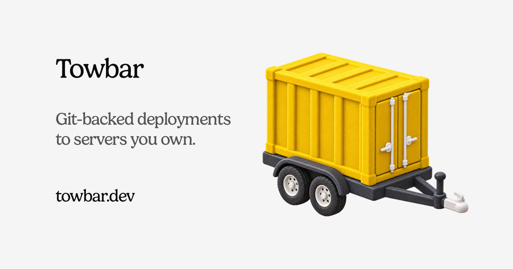

# Towbar

[](https://www.towbar.dev)

Towbar is an opinionated, source-driven deployment platform for Ubuntu servers
you own. It treats a repository's `.towbar/deployment.yml` as infrastructure
truth and runs deployments through durable Temporal workflows.

> [!IMPORTANT]
> Towbar is under active development. Read [SECURITY.md](SECURITY.md) and the
> [architecture guide](docs/docs/architecture.md) before exposing an installation to
> the internet.

## Highlights

- GitHub repositories and versioned manifests define Sources, Servers, Apps,
  Resources, domains, and deployment policy.
- Builds run on the target host, without requiring a container registry.
- AWS Secrets Manager values are resolved just in time and stay out of Git.
- Immutable deployment plans compare a candidate commit with active Source
  state before any mutation, including explicit no-op rows and validation.
- Successful releases retain their content-addressed Docker image digest and
  platform alongside the existing source, manifest, and build-input digests.
- SSH host-key pinning, server preparation, queued deployments, control-plane
  diagnostics, and runtime capacity checks are built in.
- Opt-in pull request Previews use stable URLs, isolated secrets, one live PR
  status comment, and automatic cleanup without changing production health or
  release history.
- Deployment-relevant pull requests publish one idempotent GitHub Check linked
  to the complete plan in Towbar.
- Source-scoped Slack and SMTP destinations deliver operational events through
  durable, independently retryable attempts without storing credentials in
  Towbar.
- Managed PostgreSQL and Redis backups include continuous restore-readiness
  assurance and safety-gated, auditable restores with bounded rollback.
- PostgreSQL and Temporal provide persistent state and durable execution.

## Quick start

Requirements: Docker Engine with Compose v2, Git, and OpenSSL.

```bash
git clone https://github.com/avgeek-inc/towbar.git
cd towbar
cp .env.example .env
```

Replace every placeholder in `.env`, then start Towbar:

```bash
docker compose up --build --detach --wait
```

Open `http://localhost:4021` and create the first owner account. Continue with
the [getting-started guide](docs/docs/getting-started.md) to connect GitHub, add a
Source, prepare a server, and make the first deployment.

## Documentation

- [Getting started](docs/docs/getting-started.md)
- [Configuration](docs/docs/configuration.md)
- [Deployment manifest](https://www.towbar.dev/docs/deployment-file)
- [Architecture](docs/docs/architecture.md)
- [Managed database restores](docs/docs/managed-restores.md)
- [Changelog](CHANGELOG.md)
- [Security policy](SECURITY.md)

## Development

Towbar uses Node.js 24, pnpm 11, and Turborepo.

```bash
corepack enable
pnpm install --frozen-lockfile
pnpm verify
```

The Mintlify project lives in `docs/`. When the public manifest schema or
starter manifest changes, update their published copies and verify they remain
in lockstep:

```bash
pnpm docs:sync
pnpm docs:check
```

Install the [Mintlify CLI](https://www.mintlify.com/docs/cli/install), then run
`mint dev` from `docs/` for a local documentation preview. Mintlify should be
configured with `/docs` as this repository's documentation path.

See [CONTRIBUTING.md](CONTRIBUTING.md) before opening a pull request. Towbar is
authored by **Avgeek, Inc.** and maintained by
[Praveen Thirumurugan (@praveentcom)](https://github.com/praveentcom).

## License

Licensed under the [Apache License 2.0](LICENSE).
