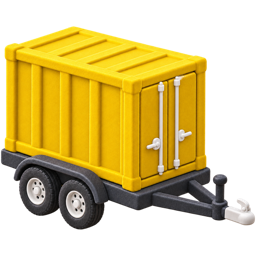
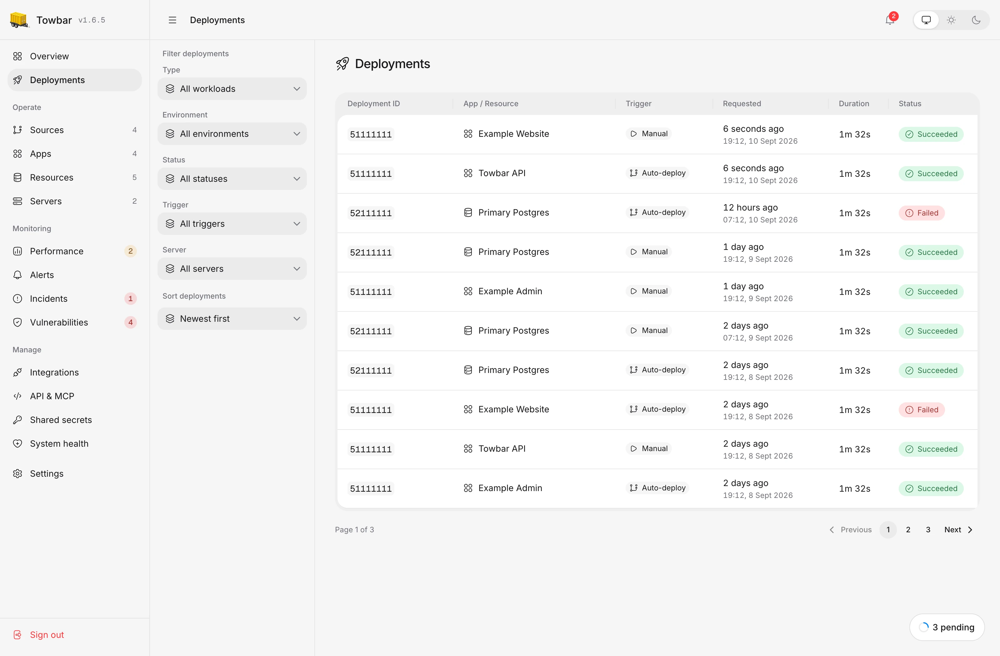

<p align="center">
  <a href="https://www.towbar.dev">
    
  </a>
</p>

<h1 align="center">Towbar</h1>

<p align="center"><strong>Open-Source, Git-native PaaS</strong></p>
<p align="center">Deploy apps and databases from Git to servers you own.</p>

<p align="center">
  <a href="https://www.towbar.dev">Website</a> ·
  <a href="https://www.towbar.dev/docs">Documentation</a> ·
  <a href="https://www.towbar.dev/docs/getting-started">First deployment</a> ·
  <a href="https://github.com/avgeek-inc/towbar/issues">Issues</a>
</p>

<picture>
  <source media="(prefers-color-scheme: dark)" srcset="docs/assets/deployments-dark.webp" />
  
</picture>

_An example Towbar workspace. Follow each deployment from its source commit to its final result._

Towbar brings repository configuration, deployments, and day-to-day operations
into one dashboard. Connect GitHub, register an Ubuntu server, and describe your
workloads in a manifest. Towbar builds and runs them on your infrastructure.

## What you can do

- **Deploy from Git.** Keep configuration alongside your code. Deploy manually,
  enable automatic deployments, or limit rebuilds to changes in selected files.
- **Run apps and databases.** Build Dockerfile apps directly on your servers,
  without a container registry. Run PostgreSQL, Redis, and container images with
  persistent storage.
- **Preview pull requests.** Give eligible pull requests a stable URL and
  separate secrets. Towbar cleans up preview environments when they close or merge.
- **Manage secrets.** Store encrypted, write-only values at workspace, Source,
  or workload scope. Keep production and preview configuration separate.
- **See health and capacity.** Follow deployment stages, inspect logs, and compare
  observed CPU and memory usage with workload allocations. Check host capacity
  and control-plane health from the same dashboard.
- **Back up and restore databases.** Schedule PostgreSQL and Redis backups to S3,
  check restore readiness, and restore through an isolated candidate before promotion.
- **Stay informed.** Route deployment, preview, health, backup, and restore events
  to Slack channels or email recipients.

## How it works

1. **Connect a Source:** a GitHub repository with a `.towbar/deployment.yml` manifest.
2. **Register a server:** add an Ubuntu host, verify its SSH identity, and prepare
   Docker and Caddy. Multiple Sources can share one server.
3. **Deploy:** Towbar builds or pulls the image, starts a candidate, checks its
   health, and promotes it to serve traffic.

The control plane runs with Docker Compose. PostgreSQL stores state and Temporal
coordinates durable workflows. Deployment targets are the Ubuntu hosts you
register; you choose their provider and capacity.

### Configuration lives with your code

This manifest defines a Dockerfile app with a domain, health check, and resource limits:

```yaml
version: 1
source:
  branch: main
apps:
  - id: web
    name: Web
    server: 203.0.113.10
    dockerfile: Dockerfile
    context: .
    container:
      port: 3000
      resources:
        cpus: 1
        memory: 1g
    health:
      path: /health
      timeoutSeconds: 60
    domains:
      primary: app.example.com
    tls:
      mode: direct
```

Save it as `.towbar/deployment.yml` in the repository you want to deploy. Replace
the IP and domain, register the server, and point DNS at it. Your app must listen
on port 3000 and respond at `/health`. Add secrets through Towbar's editor.

See the [manifest reference](https://www.towbar.dev/docs/reference/deployment-manifest)
for databases, previews, deployment hooks, and automatic deployment rules.

## Get started

Use a Linux host with Docker Engine, Compose v2, Git, and OpenSSL for the control
plane. Deployment targets must run Ubuntu 22.04 or 24.04 LTS with SSH access.

```bash
git clone https://github.com/avgeek-inc/towbar.git
cd towbar
cp .env.example .env
```

Set the four required secrets in `.env`: `TOWBAR_POSTGRES_PASSWORD`,
`TOWBAR_DATABASE_RUNTIME_PASSWORD`, `TOWBAR_INTERNAL_HMAC_SECRET`, and
`TOWBAR_CREDENTIALS_KEY`. Generate each of the first three independently with
`openssl rand -hex 32`; generate the encryption key with `openssl rand -base64 32`.
Keep the default loopback binding during initial setup.

```bash
docker compose up --build --detach --wait
```

Open [localhost:4021](http://localhost:4021) and create the owner account. Follow
[Install Towbar](https://www.towbar.dev/docs/self-hosting/installation) to configure
HTTPS ingress, then [Your first deployment](https://www.towbar.dev/docs/getting-started)
to connect a GitHub App, prepare a server, and deploy an app. GitHub webhooks need
an API origin reachable over HTTPS.

You operate the hosts, network access, and control-plane backups. The
[self-hosting security guide](https://www.towbar.dev/docs/self-hosting/security)
explains the installation's trust boundaries and credential handling.

## Explore the docs

| Deploy                                                       | Operate                                                       | Self-host                                                                    |
| ------------------------------------------------------------ | ------------------------------------------------------------- | ---------------------------------------------------------------------------- |
| [Apps](https://www.towbar.dev/docs/apps)                     | [Health and capacity](https://www.towbar.dev/docs/monitoring) | [Installation](https://www.towbar.dev/docs/self-hosting/installation)        |
| [Resources](https://www.towbar.dev/docs/resources)           | [Backups](https://www.towbar.dev/docs/backups)                | [Architecture](https://www.towbar.dev/docs/self-hosting/architecture)        |
| [Preview environments](https://www.towbar.dev/docs/previews) | [Restores](https://www.towbar.dev/docs/restores)              | [Upgrades](https://www.towbar.dev/docs/self-hosting/upgrades)                |
| [Domains and TLS](https://www.towbar.dev/docs/domains-tls)   | [Shared secrets](https://www.towbar.dev/docs/secrets)         | [Configuration](https://www.towbar.dev/docs/reference/environment-variables) |

## Contribute

Bug reports, feature requests, documentation improvements, and code contributions
are welcome. [Open an issue](https://github.com/avgeek-inc/towbar/issues) or read
[CONTRIBUTING.md](CONTRIBUTING.md) for local setup and checks. Report vulnerabilities
privately using the [security policy](SECURITY.md).

Towbar uses Node.js 24, pnpm 11, and Turborepo. See the
[changelog](CHANGELOG.md) for release history.

## License

[Apache License 2.0](LICENSE). Created by **Avgeek, Inc.** and maintained by
[Praveen Thirumurugan](https://github.com/praveentcom).
