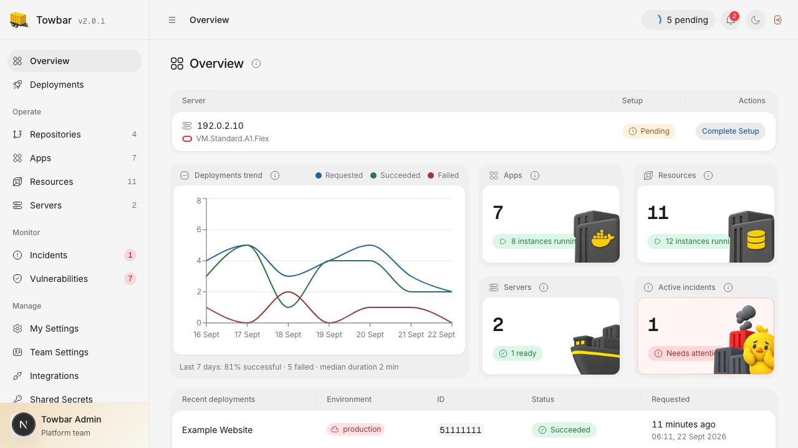

<p align="center">
  <a href="https://www.towbar.dev">
    
  </a>
</p>

<h1 align="center">Towbar</h1>

<p align="center"><strong>Open-source, Git-native PaaS</strong></p>
<p align="center">Deploy anything to servers you own, defined via Git repositories.<br />Previews, monitoring, and batteries included.</p>

<p align="center">
  <a href="https://www.towbar.dev">Website</a> ·
  <a href="https://www.towbar.dev/docs">Documentation</a> ·
  <a href="https://www.towbar.dev/blog/introducing-towbar">Introducing Towbar</a> ·
  <a href="https://github.com/avgeek-inc/towbar/issues">Issues</a>
</p>

<p align="center">
  <picture>
    <source media="(prefers-color-scheme: dark)" srcset="docs/assets/release-v2/overview-dark.jpg" />
    
  </picture>
</p>

Towbar lets you deploy apps, databases, and other services to servers you own.
Connect a Git repository, describe what should run, and manage it from one
dashboard.

Towbar is self-hosted. Your Git credentials, secrets, deployment history, and
monitoring data stay on your Towbar instance.

## Why Towbar

- **Your setup lives in Git.** Review deployment changes with your code and see
  exactly which commit is running.
- **Your servers and data stay yours.** Towbar runs on your infrastructure and
  keeps credentials and secrets on your instance.
- **One dashboard covers the work.** Deploy, preview, monitor, back up, restore,
  and troubleshoot without piecing together separate tools.
- **Environments remain separate.** Production, staging, and other environments
  can follow different branches and keep their own secrets and data.
- **It is open source and self-hosted.** You can inspect the code, change it, and
  run Towbar without a hosted Towbar account.

## What's included

| Area          | What you get                                                                                                     |
| ------------- | ---------------------------------------------------------------------------------------------------------------- |
| Apps          | Deploy from a Dockerfile, static site, buildpack, container image, or Docker Compose file                        |
| Databases     | PostgreSQL, MySQL, MariaDB, MongoDB, Redis, Dragonfly, KeyDB, and ClickHouse                                     |
| Git workflows | GitHub and GitLab connections, branch-based environments, automatic deployments, and pull-request previews       |
| Domains       | Custom domains and automatic HTTPS                                                                               |
| Operations    | Logs, server and container monitoring, alerts, incidents, scheduled jobs, and vulnerability scans                |
| Backups       | Scheduled backups, restores, retention rules, and common cloud-storage destinations                              |
| Team access   | Admin, Member, and Viewer roles, invitations, passkeys, authenticator 2FA, sessions, API keys, and audit history |
| Automation    | REST API and MCP access for HTTPS installations                                                                  |

## Install Towbar

Run Towbar on a dedicated Ubuntu or Debian server. The installer asks whether
you want a local-only setup or a public HTTPS domain. If you choose a domain,
point its DNS A record to the server first.

Run the installer:

```bash
curl -fsSL https://raw.githubusercontent.com/avgeek-inc/towbar/main/install.sh | sudo bash
```

The installer prepares the server, downloads Towbar, creates the required
configuration, and starts it. When it finishes, open the URL it prints, create
your Admin account, connect GitHub or GitLab, and add a deployment server.

Read [Install Towbar](https://www.towbar.dev/docs/self-hosting/installation) for
server requirements, DNS, HTTPS, configuration, and recovery. The
[CLI guide](https://www.towbar.dev/docs/self-hosting/cli) lists every available
command.

> [!NOTE]
> REST API, MCP, and API-key management are available only on HTTPS
> installations. A localhost-only installation exposes the dashboard on the
> Towbar host and keeps those interfaces disabled.

## Declare a repository

Towbar reads a root `towbar.yml` and entity files under `.towbar/apps/`,
`.towbar/resources/`, and `.towbar/compose/`.

```yaml
# towbar.yml
version: 2
environments:
  production: {}
  staging:
    previews:
      enabled: true
```

Map each environment to a branch in Towbar. Every sync reads one immutable
revision and applies the validated inventory atomically. Manifest files contain
the required secret names, while encrypted values stay in Towbar and out of Git.

Start with the [example configuration](examples/) or follow
[Your first deployment](https://www.towbar.dev/docs/getting-started). The
[deployment manifest](https://www.towbar.dev/docs/deployment-manifest) documents
the complete schema with focused examples.

## Architecture

The control plane runs as a Docker Compose stack:

- the **dashboard** presents deployment and operational state;
- the **API** owns validation, authorization, persistence, REST, MCP, and
  real-time transports;
- the **worker** executes durable Temporal workflows;
- **PostgreSQL** stores control-plane state;
- **Temporal** coordinates deployments and long-running operations; and
- the optional **Caddy gateway** provides one HTTPS origin and automatic TLS.

Target servers run the workloads Towbar manages. Scout Agent is opt-in and
reports server and container measurements back to the control plane.

Read the [architecture guide](https://www.towbar.dev/docs/architecture) for the
service boundaries, repository layout, data model, workflow path, security
model, and direct links into the implementation.

## Documentation

- **[Introduction](https://www.towbar.dev/docs)** — concepts, architecture,
  installation, CLI, first deployment, and migration guides.
- **[Deploy](https://www.towbar.dev/docs/apps)** — repositories, servers, apps,
  resources, releases, previews, domains, secrets, and manifest fields.
- **[Databases](https://www.towbar.dev/docs/databases)** — supported engines,
  configuration, health checks, backups, and restores.
- **[Operate](https://www.towbar.dev/docs/monitoring)** — Scout Agent,
  performance, alerts, incidents, vulnerability scanning, troubleshooting, and
  workspace access.
- **[Integrations](https://www.towbar.dev/docs/integrations)** — source control,
  registries, backup destinations, external secrets, platform services,
  notifications, and log forwarding.
- **[API & MCP](https://www.towbar.dev/docs/api)** — authentication, endpoints,
  MCP tools, and automation workflows.

Moving an existing workload? Start with the candid migration guides for
[Coolify](https://www.towbar.dev/docs/migrate-from-coolify),
[Dokploy](https://www.towbar.dev/docs/migrate-from-dokploy),
[CapRover](https://www.towbar.dev/docs/migrate-from-caprover),
[Dokku](https://www.towbar.dev/docs/migrate-from-dokku),
[Heroku](https://www.towbar.dev/docs/migrate-from-heroku),
[Railway](https://www.towbar.dev/docs/migrate-from-railway),
[Render](https://www.towbar.dev/docs/migrate-from-render), or
[Vercel](https://www.towbar.dev/docs/migrate-from-vercel).

## Contribute

Bug reports, feature requests, documentation improvements, and code
contributions are welcome. [Open an issue](https://github.com/avgeek-inc/towbar/issues)
or read [CONTRIBUTING.md](CONTRIBUTING.md) for the local setup and required
checks. Report vulnerabilities privately through [SECURITY.md](SECURITY.md).

Towbar uses Node.js 24, pnpm 11, and Turborepo. Release history is recorded in
[CHANGELOG.md](CHANGELOG.md).

## License

[Apache License 2.0](LICENSE). Created by **Avgeek, Inc.** and maintained by
[Praveen Thirumurugan](https://github.com/praveentcom).
