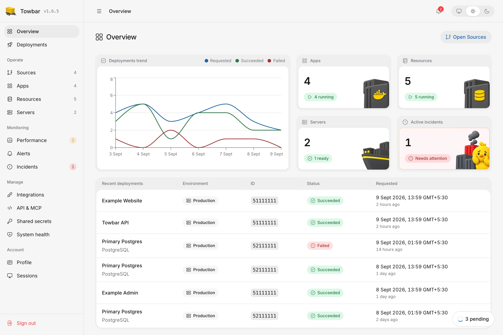

<p align="center">
  <a href="https://www.towbar.dev">
    
  </a>
</p>

<h1 align="center">Towbar</h1>

<p align="center"><strong>Open-Source, Git-native PaaS</strong></p>
<p align="center">Deploy apps and databases from Git to servers you own.</p>

<p align="center">
  <a href="https://www.towbar.dev">Website</a> ·
  <a href="https://www.towbar.dev/docs">Documentation</a> ·
  <a href="https://www.towbar.dev/docs/getting-started">First deployment</a> ·
  <a href="https://github.com/avgeek-inc/towbar/issues">Issues</a>
</p>

<picture>
  <source media="(prefers-color-scheme: dark)" srcset="docs/assets/overview-dark.webp" />
  
</picture>

_An example Towbar workspace: deployment trends, workload status, active incidents, and recent activity._

Towbar brings repository configuration, deployments, and day-to-day operations
into one dashboard. Connect GitHub, register an Ubuntu server, and describe your
workloads in a manifest. Towbar builds and runs them on your infrastructure.

## What you can do

| Feature                | What it gives you                                                                                                                                                              |
| ---------------------- | ------------------------------------------------------------------------------------------------------------------------------------------------------------------------------ |
| Deploy from Git        | Keep configuration with your code. Deploy manually, automatically, or only when selected files change.                                                                         |
| Separate environments  | Map production, staging, and other environments to branches in Towbar. Keep instance configuration, secrets, containers, and data separate.                                    |
| Run apps and databases | Build Dockerfile apps on your servers. Run PostgreSQL, Redis, and container images with persistent storage.                                                                    |
| Preview pull requests  | Share a stable preview URL with separate secrets. Environments are cleaned up when pull requests close or merge.                                                               |
| Manage secrets         | Edit encrypted values in Form or .env File mode, with owner-only reveal and explicit shared references.                                                                        |
| Monitor performance    | Track server and workload history with Scout Agent, configure alerts and public uptime checks, and compare deployments for changes in resource usage.                          |
| Back up and restore    | Schedule PostgreSQL and Redis backups to S3, Google Cloud Storage, or Azure Blob Storage, check restore readiness, and restore through an isolated candidate before promotion. |
| Stay informed          | Send deployment, preview, health, backup, and restore events to Slack or email.                                                                                                |

## Meet Scout Agent


[Scout Agent](https://www.towbar.dev/docs/scout) is Towbar’s opt-in monitoring agent.
Follow server, app, and resource performance with updates every 30 seconds,
deployment and restart markers, and up to 60 days of history. Install it from
**Server → Settings → Scout Agent**.

## Monitor, alert, and investigate

- **Performance:** select a server, app, or resource in the monitoring sidebar to inspect CPU, memory, disk, and network history. Compare releases with equal observation windows and share a filtered view by URL.
- **Alerts and incidents:** define metric thresholds or public HTTP checks, receive Slack or email notifications, and inspect active or resolved incidents with their graphs and delivery history. Maintenance mutes pause notifications while incident tracking continues.
- **Vulnerabilities:** opt apps into image scanning after successful deployments. Review severity totals, affected packages, installed and fixed versions, and the scan’s freshness. Scanning reports findings separately from deployment success.

Read the [monitoring guide](https://www.towbar.dev/docs/monitoring), [Scout Alerts guide](https://www.towbar.dev/docs/scout-alerts), and [vulnerability scanning guide](https://www.towbar.dev/docs/vulnerability-scanning).

## How it works

1. **Register a server:** add an Ubuntu host, choose its server slug, verify its
   SSH identity, and prepare Docker and Caddy. Multiple Sources can share one server.
2. **Connect a Source:** select a GitHub repository containing `towbar.yml` and
   entity files under `.towbar/apps/` and `.towbar/resources/`. Map each environment
   to a branch in Towbar and sync its configuration.
3. **Set required secrets:** fill the keys declared by each environment’s apps
   and resources. Sync preserves existing values and adds new keys as unset.
4. **Deploy:** Towbar builds or pulls the image, starts a candidate, checks its
   health, and promotes it to serve traffic.

### Production, staging, and previews

Declare environments in the root file:

```yaml
# towbar.yml
version: 2
environments:
  production: {}
  staging:
    previews:
      enabled: true
```

Map production to `main` and staging to `develop`, for example, in Source
settings. Branch names stay in Towbar so you can change them without editing
Git configuration. Connecting or changing a mapping syncs without deploying.

Each `*.app.yml` or `*.resource.yml` file defines one logical workload, with
shared settings and explicit environment overrides. Those overrides can select
different server slugs, domains, and container settings. Each environment has
its own workload instances and secret values. PRs targeting a preview-enabled
environment’s branch can deploy previews for opted-in apps, using isolated
preview secrets.

See the [root example](examples/towbar.yml) and
[app example](examples/.towbar/apps/hello-towbar.app.yml), or read the
[configuration guide](https://www.towbar.dev/docs/reference/deployment-manifest).

The control plane runs with Docker Compose. PostgreSQL stores state and Temporal
coordinates durable workflows. Deployment targets are the Ubuntu hosts you
register; you choose their provider and capacity.

## Documentation

Installation and configuration live in the [Towbar documentation](https://www.towbar.dev/docs).

- **[Install Towbar](https://www.towbar.dev/docs/self-hosting/installation)** — set up your control plane.
- **[Deploy your first app](https://www.towbar.dev/docs/getting-started)** — connect GitHub, prepare a server, and deploy.
- **[Browse the guides and reference](https://www.towbar.dev/docs)** — apps, databases, previews, Scout Agent, API, MCP, and operations.

Start with the [v2 example configuration](examples/) in this repository.

## Contribute

Bug reports, feature requests, documentation improvements, and code contributions
are welcome. [Open an issue](https://github.com/avgeek-inc/towbar/issues) or read
[CONTRIBUTING.md](CONTRIBUTING.md) for local setup and checks. Report vulnerabilities
privately using the [security policy](SECURITY.md).

Towbar uses Node.js 24, pnpm 11, and Turborepo. See the
[changelog](CHANGELOG.md) for release history.

## License

[Apache License 2.0](LICENSE). Created by **Avgeek, Inc.** and maintained by
[Praveen Thirumurugan](https://github.com/praveentcom).
