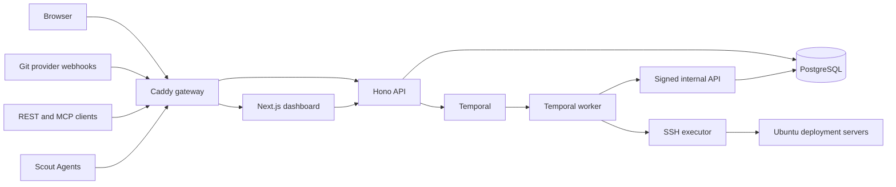
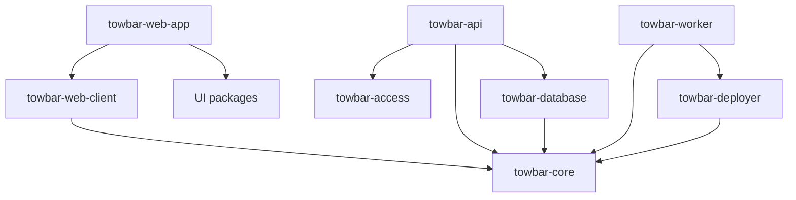
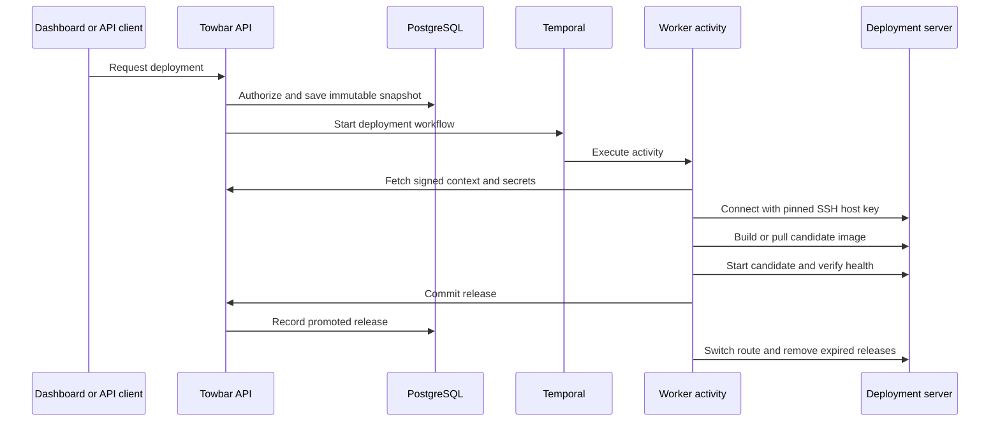

Towbar is a monorepo with a small control plane and an SSH-based deployment plane. The public repository contains the dashboard, API, workflow worker, deployment executor, database schema, installer, examples, and release checks. You can trace a request from the browser to the code that changes a server without relying on a separate hosted service.

<CardGroup cols={2}>
  <Card
    title="Browse the source"
    icon="github"
    href="https://github.com/avgeek-inc/towbar"
  >
    Open the complete Apache-2.0 repository on GitHub.
  </Card>
  <Card
    title="Run the checks"
    icon="circle-check"
    href="https://github.com/avgeek-inc/towbar/blob/main/CONTRIBUTING.md"
  >
    See the local development, documentation, and verification commands.
  </Card>
</CardGroup>

## Runtime topology

The dashboard and API share one origin. Caddy sends `/v1/*` requests to the API and everything else to the Next.js dashboard. PostgreSQL stores control-plane state. Temporal stores workflow history and schedules durable work. The worker performs side effects and reaches deployment servers over SSH.

The Compose topology is declared in [`docker-compose.yml`](https://github.com/avgeek-inc/towbar/blob/main/docker-compose.yml). The public routing rule is deliberately short and visible in [`infra/gateway/Caddyfile`](https://github.com/avgeek-inc/towbar/blob/main/infra/gateway/Caddyfile). Temporal and PostgreSQL stay on the private Compose network. A local installation publishes only the dashboard gateway on `127.0.0.1:4021`.

## Repository map

Towbar uses pnpm workspaces and Turborepo. Deployable processes live under `apps/`; reusable contracts and implementation boundaries live under `packages/`.

| Area                     | Responsibility                                                                                                               | Source                                                                                                                                                                                                                                                                                                                      |
| ------------------------ | ---------------------------------------------------------------------------------------------------------------------------- | --------------------------------------------------------------------------------------------------------------------------------------------------------------------------------------------------------------------------------------------------------------------------------------------------------------------------- |
| Dashboard                | Next.js operator interface, authentication screens, route-level data loading, and live deployment views                      | [`apps/towbar-web-app`](https://github.com/avgeek-inc/towbar/tree/main/apps/towbar-web-app)                                                                                                                                                                                                                                 |
| API                      | Hono routes, authentication, authorization, provider webhooks, admission checks, persistence, REST, and MCP                  | [`apps/towbar-api`](https://github.com/avgeek-inc/towbar/tree/main/apps/towbar-api)                                                                                                                                                                                                                                         |
| Worker                   | Temporal workflows and activities for deployments, source syncs, backups, restores, notifications, scanning, and maintenance | [`apps/towbar-worker`](https://github.com/avgeek-inc/towbar/tree/main/apps/towbar-worker)                                                                                                                                                                                                                                   |
| Scout Agent              | Dependency-free Go collector installed on deployment servers when monitoring is enabled                                      | [`apps/towbar-monitoring-agent`](https://github.com/avgeek-inc/towbar/tree/main/apps/towbar-monitoring-agent)                                                                                                                                                                                                               |
| Core contracts           | Manifest parsing, reconciliation, workflow types, security rules, provider metadata, and shared domain types                 | [`packages/towbar-core`](https://github.com/avgeek-inc/towbar/tree/main/packages/towbar-core)                                                                                                                                                                                                                               |
| Database                 | Drizzle schema, typed PostgreSQL client, and forward migrations                                                              | [`packages/towbar-database`](https://github.com/avgeek-inc/towbar/tree/main/packages/towbar-database)                                                                                                                                                                                                                       |
| Deployer                 | SSH sessions, Docker builds and pulls, candidate health checks, Caddy routing, release promotion, rollback, and cleanup      | [`packages/towbar-deployer`](https://github.com/avgeek-inc/towbar/tree/main/packages/towbar-deployer)                                                                                                                                                                                                                       |
| Access control           | Shared roles, permissions, API-key ceilings, and browser-only operation rules                                                | [`packages/towbar-access`](https://github.com/avgeek-inc/towbar/tree/main/packages/towbar-access)                                                                                                                                                                                                                           |
| Browser client           | Typed API and authentication client shared by the dashboard                                                                  | [`packages/towbar-web-client`](https://github.com/avgeek-inc/towbar/tree/main/packages/towbar-web-client)                                                                                                                                                                                                                   |
| UI packages              | Product UI compositions, design-system components, and page sections                                                         | [`packages/towbar-web-ui`](https://github.com/avgeek-inc/towbar/tree/main/packages/towbar-web-ui), [`packages/web-design-system`](https://github.com/avgeek-inc/towbar/tree/main/packages/web-design-system), and [`packages/web-page-sections`](https://github.com/avgeek-inc/towbar/tree/main/packages/web-page-sections) |
| Installer and operations | Host inspection, installation, upgrades, configuration validation, diagnostics, and release retention                        | [`infra/towbar-cli`](https://github.com/avgeek-inc/towbar/tree/main/infra/towbar-cli)                                                                                                                                                                                                                                       |

This split keeps the dependency direction clear. The API owns authorization and database changes. Temporal workflows describe durable coordination. Activities perform network and filesystem work. The deployer knows how to change a remote host but has no database dependency. The dashboard uses HTTP contracts and never reads PostgreSQL directly.

## How a repository becomes inventory

Towbar treats Git as the workload contract while keeping server credentials and secret values out of the repository.

1. A repository connection maps a Towbar environment to a branch.
2. The API starts or signals a durable source workflow in Temporal.
3. A worker activity calls the signed internal source-sync route.
4. The API fetches one immutable commit from the configured Git provider.
5. [`manifest-v2.ts`](https://github.com/avgeek-inc/towbar/blob/main/packages/towbar-core/src/manifest-v2.ts) parses `towbar.yml` plus `.towbar/apps`, `.towbar/resources`, and `.towbar/compose` files with strict schemas.
6. [`reconciliation.ts`](https://github.com/avgeek-inc/towbar/blob/main/packages/towbar-core/src/reconciliation.ts) compares the accepted manifest with the current inventory.
7. The API applies the result transactionally. Invalid input leaves the previous inventory and secret slots intact.

The parser resolves one environment at a time. Each environment therefore gets a digest derived from its branch and effective configuration, rather than from mutable dashboard form state.

<CardGroup cols={2}>
  <Card
    title="Manifest implementation"
    icon="file-code"
    href="https://github.com/avgeek-inc/towbar/blob/main/packages/towbar-core/src/manifest-v2.ts"
  >
    Read the root manifest, entity discovery, strict YAML parsing, and
    environment resolution.
  </Card>
  <Card
    title="Example repository"
    icon="folder-git-2"
    href="https://github.com/avgeek-inc/towbar/tree/main/examples"
  >
    See Dockerfile, image, static, Buildpacks, Railpack, Nixpacks, and Compose
    examples.
  </Card>
</CardGroup>

## How a deployment runs

A deployment is a durable operation with an immutable snapshot. The API admits the request and records the snapshot before the worker touches a server.

The important handoffs are visible in a small set of files:

- [`areas/deployments/service.ts`](https://github.com/avgeek-inc/towbar/blob/main/apps/towbar-api/src/areas/deployments/service.ts) owns admission, immutable snapshots, execution context, secret resolution, and release commits.
- [`deployment.workflow.ts`](https://github.com/avgeek-inc/towbar/blob/main/apps/towbar-worker/src/workflows/deployment.workflow.ts) defines the durable sequence and interruption recovery policy.
- [`activities/deployment.ts`](https://github.com/avgeek-inc/towbar/blob/main/apps/towbar-worker/src/activities/deployment.ts) bridges Temporal to the signed internal API and deployment executor.
- [`deployment.ts`](https://github.com/avgeek-inc/towbar/blob/main/packages/towbar-deployer/src/deployment.ts) performs the remote candidate, health, promotion, rollback, and cleanup steps.
- [`ssh.ts`](https://github.com/avgeek-inc/towbar/blob/main/packages/towbar-deployer/src/ssh.ts) enforces the SSH connection and trusted-host-key boundary.

Temporal retries coordination and recovery work. The main deployment activity does not blindly rerun a failed deployment. If execution stops near promotion, recovery asks PostgreSQL whether the release commit became durable before deciding to finish cleanup or remove the candidate. This prevents an uncertain network response from rolling back a release that was already recorded.

## Public and internal API boundaries

[`apps/towbar-api/src/app.ts`](https://github.com/avgeek-inc/towbar/blob/main/apps/towbar-api/src/app.ts) builds two Hono applications from the same middleware stack:

- The public listener serves browser sessions, API keys, REST, MCP, authentication, and provider webhooks.
- The internal listener serves worker callbacks and sensitive execution context on the private Compose network.

Worker requests to the internal listener carry an installation HMAC signature, timestamp, and nonce. The API checks the signature and replay window before returning deployment context or resolved credentials. Internal routes are not published by Caddy.

Authorization rules live in [`packages/towbar-access/src/index.ts`](https://github.com/avgeek-inc/towbar/blob/main/packages/towbar-access/src/index.ts). The same permission vocabulary is used for browser sessions, personal API keys, team API keys, and system actors. Browser-only actions such as revealing a secret or opening a server terminal cannot be granted to automation keys.

## State and secret boundaries

PostgreSQL stores workspace state, accepted inventory, deployment snapshots, encrypted secret values, audit events, and runtime observations. The schema is defined in [`packages/towbar-database/src/schema/index.ts`](https://github.com/avgeek-inc/towbar/blob/main/packages/towbar-database/src/schema/index.ts), with reviewed SQL migrations under [`packages/towbar-database/drizzle`](https://github.com/avgeek-inc/towbar/tree/main/packages/towbar-database/drizzle).

Secret names belong in Git. Secret values belong in Towbar. The API encrypts stored values with AES-256-GCM and binds each ciphertext to its workspace, owner, environment, stage, and record identity. The worker resolves plaintext only when execution starts. Plaintext stays out of manifest snapshots, Temporal arguments, workflow history, audit events, and deployment logs.

Static control-plane credentials, including provider clients, notification destinations, and log drains, come from the installation environment. The API validates those settings at startup and the dashboard shows only complete integrations. OAuth grants and GitHub installation metadata are stored as workspace state because users create them through provider authorization flows.

## Deployment-server boundary

Towbar does not install a general-purpose agent to deploy applications. The worker connects to registered Ubuntu servers through SSH, verifies the stored host identity, and invokes narrowly generated Docker and Caddy operations. The deployment executor uses candidate containers and health checks before switching traffic. A failed candidate leaves the previous healthy release serving traffic.

The optional [Scout Agent](/docs/scout) has a separate job. It collects bounded host and container measurements and sends them to the HTTPS Towbar origin. Its Go implementation is under [`apps/towbar-monitoring-agent`](https://github.com/avgeek-inc/towbar/tree/main/apps/towbar-monitoring-agent). It is not part of deployment admission and cannot execute deployment commands.

## Reliability and release evidence

The repository has several levels of verification:

| Level                   | What it checks                                                                                                                           | Source                                                                                                                                                                |
| ----------------------- | ---------------------------------------------------------------------------------------------------------------------------------------- | --------------------------------------------------------------------------------------------------------------------------------------------------------------------- |
| Package tests           | Domain rules, API behavior, workflows, UI helpers, database migrations, and deployment helpers                                           | Tests beside source under [`apps`](https://github.com/avgeek-inc/towbar/tree/main/apps) and [`packages`](https://github.com/avgeek-inc/towbar/tree/main/packages)     |
| Integration groups      | Real Docker, SSH, Temporal, backup, restore, preview, log-forwarding, and scanner lifecycles against disposable targets                  | [`tools/e2e`](https://github.com/avgeek-inc/towbar/tree/main/tools/e2e) and [`tools/verification`](https://github.com/avgeek-inc/towbar/tree/main/tools/verification) |
| Production verification | Fresh Compose build and boot, database setup, first Admin, authorization, workflow recovery, and image vulnerability scans               | [`tools/verification/production.mjs`](https://github.com/avgeek-inc/towbar/blob/main/tools/verification/production.mjs)                                               |
| Release publication     | Multi-architecture images, immutable digests, provenance, SBOMs, anonymous pulls, local installation, `towbar doctor`, and restart reuse | [`.github/workflows/release-images.yml`](https://github.com/avgeek-inc/towbar/blob/main/.github/workflows/release-images.yml)                                         |

CI runs the required groups independently and uploads their logs as artifacts. Read [`tools/verification/README.md`](https://github.com/avgeek-inc/towbar/blob/main/tools/verification/README.md) for the exact coverage and the distinction between fixture, emulator, disposable-host, and live-provider evidence.

## A practical reading order

If you want to understand the implementation before running Towbar, follow this path:

1. Start with [`docker-compose.yml`](https://github.com/avgeek-inc/towbar/blob/main/docker-compose.yml) to see the processes and private networks.
2. Read [`manifest-v2.ts`](https://github.com/avgeek-inc/towbar/blob/main/packages/towbar-core/src/manifest-v2.ts) and [`reconciliation.ts`](https://github.com/avgeek-inc/towbar/blob/main/packages/towbar-core/src/reconciliation.ts) to understand the Git contract.
3. Open [`apps/towbar-api/src/app.ts`](https://github.com/avgeek-inc/towbar/blob/main/apps/towbar-api/src/app.ts) and [`apps/towbar-api/src/routes/v1`](https://github.com/avgeek-inc/towbar/tree/main/apps/towbar-api/src/routes/v1) to trace HTTP boundaries.
4. Follow one workflow from [`apps/towbar-worker/src/workflows`](https://github.com/avgeek-inc/towbar/tree/main/apps/towbar-worker/src/workflows) into its matching activity.
5. Continue into [`packages/towbar-deployer`](https://github.com/avgeek-inc/towbar/tree/main/packages/towbar-deployer) to see the remote-host behavior.
6. Review [`packages/towbar-database/src/schema/index.ts`](https://github.com/avgeek-inc/towbar/blob/main/packages/towbar-database/src/schema/index.ts) to see what state persists.
7. Run the repository checks from [`CONTRIBUTING.md`](https://github.com/avgeek-inc/towbar/blob/main/CONTRIBUTING.md).

Continue with [Your first deployment](/docs/getting-started), or read the [security model](/docs/self-hosting/security) for the supported trust assumptions and reporting process.
