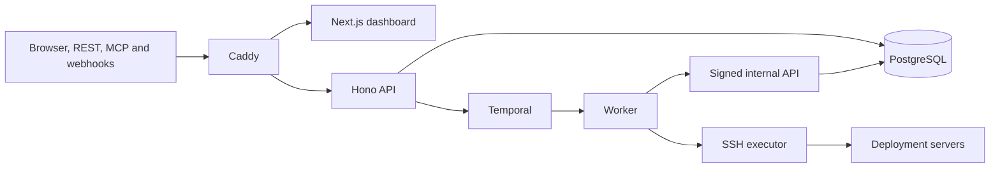
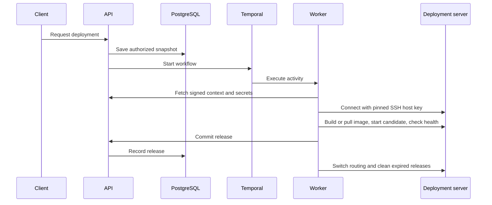

Towbar has a Docker Compose control plane and an SSH deployment executor. The [source repository](https://github.com/avgeek-oss/towbar) contains the application, installer, examples and verification tools.

## Runtime topology

Caddy routes `/v1/*` to the Hono API and other requests to the Next.js dashboard. PostgreSQL stores application state. Temporal schedules durable workflows; the worker executes them and connects to deployment servers over SSH.

```mermaid
flowchart LR
  Clients[Browser, REST, MCP and webhooks] --> Caddy
  Caddy --> Dashboard[Next.js dashboard]
  Caddy --> API[Hono API]
  API --> DB[(PostgreSQL)]
  API --> Temporal
  Temporal --> Worker
  Worker --> InternalAPI[Signed internal API]
  InternalAPI --> DB
  Worker --> SSH[SSH executor]
  SSH --> Servers[Deployment servers]
```

`docker-compose.yml` defines the stack; `infra/gateway/Caddyfile` defines routing. PostgreSQL and Temporal stay on the private network. Local installations expose only `127.0.0.1:4021`.

## Repository map

| Path                                                                                 | Responsibility                                    |
| ------------------------------------------------------------------------------------ | ------------------------------------------------- |
| `apps/towbar-web-app`                                                                | Dashboard and authentication UI                   |
| `apps/towbar-api`                                                                    | HTTP/MCP, authorization, persistence and webhooks |
| `apps/towbar-worker`                                                                 | Temporal workflows and activities                 |
| `apps/towbar-monitoring-agent`                                                       | Scout host and container measurements             |
| `packages/towbar-core`                                                               | Manifest, deployment and workflow contracts       |
| `packages/towbar-database`                                                           | PostgreSQL schema, client and migrations          |
| `packages/towbar-deployer`                                                           | SSH, Docker, routing, promotion and rollback      |
| `packages/towbar-access`                                                             | Roles and permissions                             |
| `packages/towbar-web-client`                                                         | Typed browser API client                          |
| `packages/towbar-web-ui`, `packages/web-design-system`, `packages/web-page-sections` | UI components and layouts                         |
| `infra/towbar-cli`, `infra/upgrade-runner`                                           | Host installation and upgrades                    |
| `infra/distribution`                                                                 | Shared OSS release host                           |

The API owns database changes. Worker activities perform network and filesystem work. The deployer has no database dependency, and the dashboard accesses data through the API.

## How a repository becomes inventory

1. Map an environment to a Git branch.
2. Temporal starts source sync; the API fetches one immutable commit.
3. `packages/towbar-core/src/manifest-v2.ts` parses `towbar.yml`, `.towbar/services` and `.towbar/datastores`.
4. `reconciliation.ts` compares the resolved environment with inventory and applies changes transactionally.

Invalid input preserves existing inventory and secret slots. Each environment gets a digest of its branch and effective configuration. See the [manifest reference](/docs/deployment-manifest) and repository `examples/`.

## How a deployment runs

The API authorizes the request and saves an immutable snapshot before execution.

```mermaid
sequenceDiagram
  participant Client
  participant API
  participant DB as PostgreSQL
  participant T as Temporal
  participant W as Worker
  participant H as Deployment server
  Client->>API: Request deployment
  API->>DB: Save authorized snapshot
  API->>T: Start workflow
  T->>W: Execute activity
  W->>API: Fetch signed context and secrets
  W->>H: Connect with pinned SSH host key
  W->>H: Build or pull image, start candidate, check health
  W->>API: Commit release
  API->>DB: Record release
  W->>H: Switch routing and clean expired releases
```

Trace execution through `apps/towbar-api/src/areas/deployments/service.ts`, the worker's `deployment.workflow.ts` and `activities/deployment.ts`, then `packages/towbar-deployer/src/deployment.ts` and `ssh.ts`.

Temporal retries coordination and recovery, rather than blindly repeating failed deployments. If promotion is interrupted, recovery checks the durable release record before cleanup or rollback.

## Public and internal API boundaries

The public listener serves browser sessions, API keys, REST, MCP and provider webhooks. The internal listener serves worker callbacks on the private network. Requests carry an installation HMAC signature, timestamp and nonce; the API checks authenticity and replay protection before returning context or secrets.

`packages/towbar-access` defines permissions for sessions, keys and system actors. Secret reveal and server terminals require browser access.

## State and secret boundaries

PostgreSQL stores configuration, snapshots, history, observations and encrypted credentials. Git contains secret names; Towbar stores values encrypted with AES-256-GCM and bound to their workspace and owner.

Workers resolve secrets at execution time. Plaintext stays out of snapshots, workflow history, audit events and deployment logs. Runtime configuration supplies provider clients and notification destinations; OAuth grants and GitHub installations are stored as workspace state.

## Deployment-server boundary

The worker uses SSH with verified host keys to run Docker and Caddy operations. Candidate health checks precede traffic changes; failed candidates leave the previous healthy release serving traffic.

The optional [Scout Agent](/docs/scout) reports measurements to Towbar over HTTPS. It cannot execute deployments.

## Reliability and release evidence

CI runs package tests, disposable-host integration tests, Compose startup checks and vulnerability scans. Release publication builds AMD64/ARM64 images, records digests and attestations, verifies downloads, and tests a fresh installation before promotion.

Read `tools/verification/README.md` for coverage and `.github/workflows/release-images.yml` for publication gates.

## A practical reading order

Start with `docker-compose.yml`, then the manifest parser, API routes, worker workflows and deployer. Use the [contribution guide](https://github.com/avgeek-oss/towbar/blob/main/CONTRIBUTING.md) to run checks, or follow [Your first deployment](/docs/getting-started) to use Towbar.
