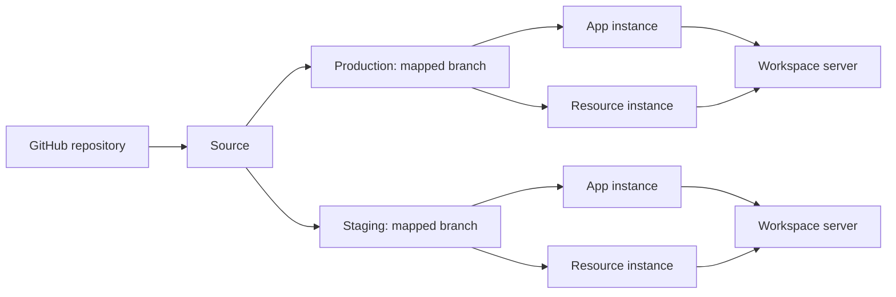

Towbar connects the configuration in Git to the services running on your servers. The dashboard records what you asked it to deploy, what ran, and what is healthy now.

## The objects you work with

| Concept     | What it represents                                                  | Where you configure it                               |
| ----------- | ------------------------------------------------------------------- | ---------------------------------------------------- |
| Workspace   | The boundary for servers, shared secrets, and integrations          | Towbar                                               |
| Source      | A connected GitHub repository                                       | Towbar                                               |
| Environment | A named deployment target, such as production or staging            | Declare in `towbar.yml`; map its branch in Towbar    |
| Server      | One Ubuntu host with a stable workspace-unique slug                 | Towbar                                               |
| App         | A logical service built from a Dockerfile                           | `.towbar/apps/**/*.app.yml`                          |
| Resource    | A logical service run from an image, including PostgreSQL and Redis | `.towbar/resources/**/*.resource.yml`                |
| Instance    | An app or resource in one connected environment                     | Shared entity settings plus environment overrides    |
| Deployment  | One attempt to build or pull, start, check, and promote an instance | Queued manually or by policy                         |
| Release     | A retained result identifying the deployed image and configuration  | Recorded by Towbar                                   |
| Preview     | An app instance associated with a pull request                      | Enable for the target environment and opt in per app |

A server can run instances from several Sources and environments. Register the physical host once, then reference its server slug in entity files. Production and staging can use different servers or share a host while keeping separate containers, volumes, and secret values.

## Configuration has three homes

**Git describes the workload.** The root file declares environments. Entity files define images or Dockerfiles, health checks, domains, resource limits, required secret keys, and deployment policy. Keep stable IDs when renaming an app or resource so its history stays attached.

**Towbar stores operational settings and secrets.** Environment-to-branch mappings, server credentials, SSH trust, concurrency, and encrypted secret values belong in Towbar. Saving a secret does not deploy it.

**The installation environment configures the control plane.** Database credentials, internal authentication, the GitHub App, Slack, and SMTP are configured on the host running Towbar.

## A sync is different from a deployment

An environment sync reads one immutable commit from its mapped branch, validates the complete configuration, and updates its instances atomically. Invalid configuration leaves the previous instances and secret slots intact. It may queue automatic deployments when policy permits. A successful sync means the configuration was accepted; check the deployment separately to know whether it went live.

A deployment records an immutable configuration snapshot. Secret values are resolved when execution starts. Health observations describe the running container and can change after a successful deployment.

## Production, staging, and previews

Map production to `main` and staging to `develop`, for example, in Source environment settings. Each environment reads its configuration from its own branch. Changing a mapping syncs configuration without automatically deploying or replacing the environment’s identity and data.

Previews run eligible same-repository pull requests targeting the branch mapped to a preview-enabled environment, with app opt-in also required. Preview secrets are isolated from the target environment’s persistent secrets. PR configuration does not change persistent instances or their required-secret slots, and previews do not clone database resources.

Continue with [Your first deployment](/docs/getting-started), or see the [architecture](/docs/self-hosting/architecture) for service and trust boundaries.
