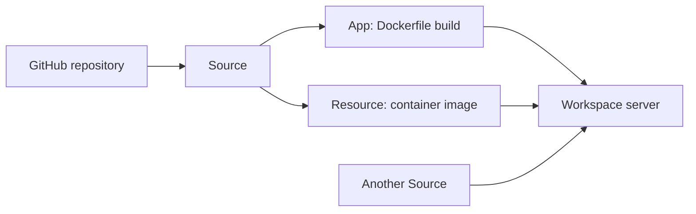

Towbar connects the configuration in Git to the services running on your servers. The dashboard records what you asked it to deploy, what ran, and what is healthy now.

## The objects you work with

| Concept    | What it represents                                                     | Where you configure it                                 |
| ---------- | ---------------------------------------------------------------------- | ------------------------------------------------------ |
| Workspace  | The boundary for servers, shared secrets, and integrations             | Towbar                                                 |
| Source     | A GitHub repository and its production branch                          | Repository selection in Towbar; branch in the manifest |
| Server     | One Ubuntu host, identified by its canonical IP                        | Towbar                                                 |
| App        | A service built from a Dockerfile                                      | `.towbar/deployment.yml`                               |
| Resource   | A service run from an image, including PostgreSQL and Redis            | `.towbar/deployment.yml`                               |
| Deployment | One attempt to build or pull, start, check, and promote a workload     | Queued manually or by policy                           |
| Release    | A retained result that identifies the deployed image and configuration | Recorded by Towbar                                     |
| Preview    | An app environment associated with a pull request                      | Enabled per app in the manifest                        |

A server can run apps and resources from several Sources. Register the physical host once, then reference its IP wherever a workload should run.

## Configuration has three homes

**Git describes the workload.** The manifest defines images or Dockerfiles, health checks, domains, resource limits, and deployment policy. Keep stable IDs when renaming an app or resource so its history stays attached.

**Towbar stores operational settings and secrets.** Server credentials, SSH trust, concurrency, and write-only secret values belong in the dashboard. Saving a secret does not deploy it.

**The installation environment configures the control plane.** Database credentials, internal authentication, the GitHub App, Slack, and SMTP are configured on the host running Towbar.

## A sync is different from a deployment

A Source sync reads a commit, validates its manifest, and updates inventory. It may queue automatic deployments when policy permits. A successful sync means the configuration was accepted; check the deployment separately to know whether it went live.

A deployment records an immutable configuration snapshot. Secret values are resolved when execution starts. Health observations describe the running container and can change after a successful deployment.

## Production and previews

Production follows `source.branch`. Previews run eligible same-repository pull requests against that branch. Each environment has its own secret inheritance, and previews do not clone database resources.

Continue with [Your first deployment](/docs/getting-started), or see the [architecture](/docs/self-hosting/architecture) for service and trust boundaries.
