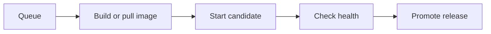

A deployment is one attempt to put an app or resource into service. Towbar records its trigger, immutable inputs, progress, duration, and final result separately from Source sync history.

<div className="towbar-doc-screenshot">
  <div className="towbar-product-light">
    
  </div>
  <div className="towbar-product-dark">
    
  </div>
  <p>
    Example deployment history. Compare the trigger, duration, and final result
    for each app or resource.
  </p>
</div>

## Browse deployment history

Use the Deployments page sidebar to filter by workload type, environment, status, trigger, or server. Sort by request time or workload name. Filters and sorting apply to the full history before pagination, and the URL preserves your selection.

On mobile, open **Page menu** to access the filters.

## Deploy manually

Open an app or resource and choose **Deploy**. The server must be prepared and trusted, and required credentials must be configured. Follow the queued operation through its recorded stages; a queued request is not a completed deployment.



The details vary by workload and configured hooks. Use the operation's actual stage output when diagnosing a failure.

## Automatic deployments

Apps and resources are manual unless `autoDeploy` is enabled. `autoDeploy: true` treats commits as deployment inputs. Apps can narrow their inputs with repository globs:

```yaml title=".towbar/apps/web.app.yml"
id: web
autoDeploy:
  inputs:
    - package.json
    - pnpm-lock.yaml
    - apps/web/**
environments:
  production: {}
```

This is a fragment, not a complete manifest. Towbar compares selected file identities and configuration to decide whether to queue work. An incomplete Git tree is treated as changed. Include every file that can affect the built app, including shared libraries and build configuration.

Use the Source's pause controls to stop automatic deployment during maintenance. Saving a secret does not enqueue a deployment; deploy explicitly when you want the new value to take effect.

## Deployment hooks

App hooks run commands around deployment. Add hook configuration under the app:

```yaml
hooks:
  preDeploy:
    command: ["node", "scripts/migrate.js"]
    timeoutSeconds: 120
  postDeploy:
    command: ["node", "scripts/warm-cache.js"]
    timeoutSeconds: 60
```

A pre-deploy failure stops deployment before promotion. A post-deploy failure is reported as a warning after promotion. Hooks receive their own stage-specific secrets. Design commands so retries are safe and schema changes remain compatible with the previous release.

## Read the final result

| Result                  | Meaning                                                            |
| ----------------------- | ------------------------------------------------------------------ |
| Succeeded               | Deployment completed successfully                                  |
| Succeeded with warnings | The release was promoted, but a later step needs attention         |
| Failed                  | A required stage failed; inspect the last stage and active release |
| Cancelled               | The operation stopped through cancellation                         |

Durations advance while work is ongoing and stop at the final timestamp. The latest runtime health can still change after deployment succeeds.

## Inspect image vulnerabilities

For opted-in apps, open **Vulnerabilities** in the deployment’s secondary sidebar to inspect the immutable image’s scan state, severity totals, and package findings. **Monitoring → Vulnerabilities** collects findings across the workspace. A successful deployment can still have vulnerabilities; a scan failure does not change deployment health. See [Vulnerability scanning](/docs/vulnerability-scanning) for setup and result interpretation.

## Roll back an image

Use a retained release when you need to return to a previous image. Rollback uses current runtime secrets, so it does not restore revoked credentials. It also does not undo database writes or schema migrations. Check compatibility before rolling back an app that ran a migration.

Database recovery is a separate [restore operation](/docs/restores). For build or startup failures, follow [Troubleshooting](/docs/troubleshooting).
