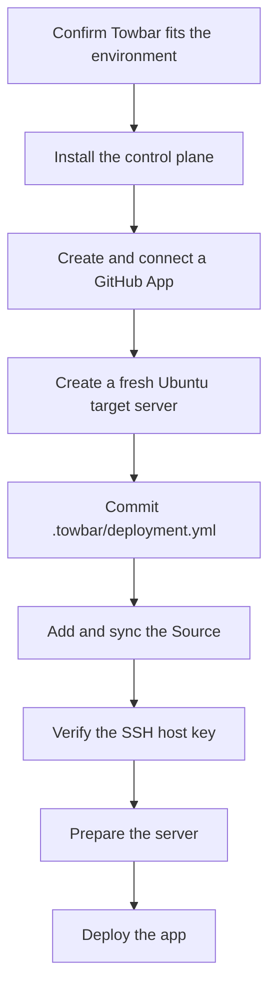

This guide follows the complete path from evaluating Towbar to completing a
first deployment.



## 1. Confirm the fit

Towbar version 1 is intentionally narrow. It fits an operator who has:

- a Linux host for the Towbar control plane;
- one or more maintained Ubuntu deployment servers;
- GitHub repositories containing Dockerfiles;
- authority to create and install a GitHub App.

Towbar treats the configured Git branch as deployment truth. It does not offer
public sign-up, build arbitrary untrusted pull requests, publish a container
registry, or restore databases automatically. Managed PostgreSQL and Redis
restores are explicit owner actions with confirmation, isolated validation,
and rollback safeguards. Read
[the architecture guide](/docs/architecture) and [security guide](/docs/security)
before exposing an installation to the internet.

## 2. Install the control plane

Install Docker Engine with Compose v2, Git, and OpenSSL on the control-plane
host. Clone Towbar and create the local environment file:

```bash
git clone https://github.com/avgeek-inc/towbar.git
cd towbar
cp .env.example .env
```

Generate each PostgreSQL password and the HMAC secret independently:

```bash
openssl rand -hex 32
```

Generate the credential-encryption key separately. It must decode to exactly 32
bytes:

```bash
openssl rand -base64 32 | tr -d '\n'
```

Put those values in `.env`. For an internet reachable installation, also
replace the three base URLs before building. The API and web app need reachable
HTTPS origins; login stays on the web app origin. `TOWBAR_WEBSITE_BASE_URL` is
an external link target; Towbar does not run the website in this repository.

Start the stack:

```bash
docker compose up --build --detach --wait
docker compose ps
```

Open `TOWBAR_APP_BASE_URL`; with the default local configuration it is
`http://localhost:4021`. Towbar sends the first visitor to `/login` and a
one-time setup form for the owner name, email, and password. The API serializes
that creation and locks setup permanently after the first account exists.
Complete setup while the services are still loopback-bound, before enabling
public ingress.

If the owner password is later forgotten, use the environment-and-restart
procedure in [Configuration](/docs/configuration#forgotten-owner-password).
Towbar has no browser-accessible password-reset flow.

The loopback defaults are suitable for evaluating the UI on the host. GitHub
webhooks require the API URL to be reachable over HTTPS, so a complete
push-to-deploy setup also needs a maintained reverse proxy or private ingress.

## 3. Create the GitHub App

Create one GitHub App for this Towbar installation:

- Repository contents: read-only
- Repository metadata: read-only
- Checks: read and write (required for deployment-plan reporting)
- Pull requests: read and write (required for Preview deployments and their PR status comment)
- Deployments: read and write (required when using Preview deployments)
- Webhook events: `push`, `pull_request`, and `installation`
- Webhook URL: `${TOWBAR_API_BASE_URL}/v1/public/webhooks/github`
- Setup URL with redirect enabled:
  `${TOWBAR_APP_BASE_URL}/settings?section=github`

Generate a private key for the App and encode its PEM without line wrapping:

```bash
base64 < github-app.pem | tr -d '\n'
```

Set `GITHUB_APP_ID`, `GITHUB_APP_SLUG`,
`GITHUB_APP_PRIVATE_KEY_BASE64`, and a random `GITHUB_WEBHOOK_SECRET` in `.env`,
then recreate the API container:

```bash
docker compose up --detach --force-recreate api
```

In Towbar, open **Settings → GitHub**, install the App, and grant it access only
to repositories Towbar should deploy.

## 4. Create a target server

Use a fresh, dedicated Ubuntu 22.04 or 24.04 LTS server when possible. Give the
configured SSH user either root access or passwordless `sudo`; Towbar needs
that access to install and manage the deployment runtime. Restrict SSH at the
network layer and do not reuse this account for untrusted interactive users.

The **Prepare Server** action installs or validates:

- Docker Engine 28 or newer;
- Caddy running as a systemd service;
- `python3` and GNU `timeout`;
- at least 1 GiB available under Docker's data directory; and
- an SSH user that can run Docker and the required Caddy operations with
  non-interactive `sudo`.

Towbar follows the upstream
[Docker Engine](https://docs.docker.com/engine/install/ubuntu/) and
[Caddy](https://caddyserver.com/docs/install) package repositories. Caddy's
standard package is enough for `tls.mode: direct`; `tls.mode: cloudflare-dns`
uses a pinned custom build containing the `dns.providers.cloudflare` module.
Compatible installations are reused. Towbar does not remove conflicting
packages or overwrite an unmanaged Caddy binary: it stops at the failing step,
shows the reason, and asks the operator to clean the server before retrying.

Treat Docker access as root-equivalent.

After importing the Source, paste the SSH private key into **Server → Settings → Credentials**. Towbar encrypts it in its database. No AWS account is required for deployment.

AWS credentials are optional and used only for S3 backups and restores. Configure them under **Source → Settings → S3 backup credentials**, with narrowly scoped S3 permissions for the declared backup prefix. See [Managed database restores](/docs/managed-restores).

## 5. Add the deployment manifest

Copy [the starter manifest](/examples/deployment.yaml) into the repository to
deploy:

```bash
mkdir -p .towbar
cp /path/to/towbar/examples/deployment.yml .towbar/deployment.yml
```

Replace the example IP, SSH username, domain, Dockerfile,
port, and input globs. Commit the file to the branch declared in
`source.branch`. The starter file is parsed by Towbar's test suite so it cannot
silently drift away from the published schema.

## 6. Add, verify, and prepare the Source

In the dashboard:

1. Open **Sources → Add source** and select the installed repository.
2. Let Towbar import `.towbar/deployment.yml`.
3. Open the imported server's **Settings** and save its SSH private key under **Server credentials**. Configure a Cloudflare API token here if the manifest enables Cloudflare DNS.
4. Open **Source → Servers**, select the imported server, and choose
   **Check server**.
5. Compare the discovered SSH fingerprint with the server console or cloud
   provider through an independent channel. Trust it only after it matches.
6. Open the Server's **Overview** tab and choose **Prepare Server**.
7. Follow the durable preparation steps until the Server is `Ready`. Apps and
   Resources remain `Server Setup Pending` and cannot deploy before this point.

Configure shared production defaults under **Source → Settings → Secrets** and local values under **App/Resource → Settings → Secrets**. Apps have separate build, runtime, and deployment-hook stages. Resources use runtime values. Preview values are configured separately and never inherit production defaults.

Saved values are write-only: the editor shows configured keys and offers replacement inputs. **Save** applies on the next deployment; **Save and deploy** explicitly queues deployment. Shared edits let you select the affected apps and resources to deploy. See [Managed secrets](managed-secrets.md) for precedence, backups, and external secret managers.

If preparation stops on an existing server, use the reported step and command
failure to remove only the conflicting installation, then retry. A fresh
server is the recommended recovery when ownership of the existing services is
unclear.

## 7. Make the first deployment

Before changing the server, open **Source → Plans** and choose **Generate
plan**. Confirm the candidate commit and manifest digest, review every planned
change and explicit no-op, and resolve any blocking validation. Generating the
plan is read-only: it does not sync, deploy, archive, restore, or resolve secret
values.

Then open **Source → Apps**, select the imported app, and choose **Deploy**. Towbar
queues the operation, fetches the immutable Git commit, transfers the selected
build context, builds on the target, checks health, configures Caddy, and
promotes the candidate.

A working installation has all of the following:

- `docker compose ps` reports the Towbar services healthy;
- the Source's latest sync is `Succeeded`;
- the target Server is `Ready`;
- the deployment reaches `Succeeded`; and
- the configured domain serves the expected commit over HTTPS.

After the manual deployment succeeds, push a change matching
`autoDeploy.inputs`. The GitHub delivery, Source sync, and deployment should
appear independently in Towbar; a successful sync alone does not imply a
successful deployment. A deployment-relevant pull request also receives one
`Towbar deployment plan` GitHub Check linked to the immutable comparison.

## Useful diagnostics

```bash
docker compose ps
docker compose logs --follow api worker
docker compose logs --tail 200 temporal
```

See [configuration](/docs/configuration) for every installation variable. If an
issue may expose credentials or cross a trust boundary, follow
[the private reporting process](/docs/security) instead of posting logs to a
public issue.
