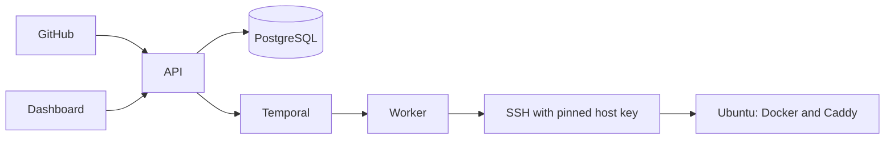

Towbar has a control plane and a deployment plane.

## Control plane

- `towbar-api` owns HTTP authentication, GitHub integration, source
  reconciliation, inventory, and operation admission. Browser/core routes use
  the published listener; signed worker routes use a separate, un-published
  Compose-network listener.
- `towbar-worker` executes Temporal workflows and activities. API-to-worker
  callbacks are signed with an installation-wide HMAC secret.
- `towbar-web-app` owns the operator dashboard, first-run setup, and login on one
  public origin. The marketing and documentation website is maintained
  separately from this self-hosted control plane.
- PostgreSQL stores control-plane state. The API uses a restricted runtime role;
  migrations use the database owner role. First-run owner setup is an atomic,
  single-use API operation.
- Temporal provides durable queues, retries, and serialized per-server work.

## Deployment plane

Each Source is a GitHub repository with a `.towbar/deployment.yml`. Successful
syncs normalize Apps and Resources into Source-scoped database records. Servers
are workspace-owned physical hosts and may run workloads from multiple Sources.
The optional AWS credential is workspace-scoped. Deployment history and
deployable runtime observations remain Source-scoped.

When a deployment is admitted, Towbar snapshots the selected manifest state and
resolves current encrypted Towbar secrets only when execution starts. The worker
connects to the target Ubuntu host over SSH, builds or pulls the requested
image, starts a replacement container, verifies health, updates the proxy, and
retains only the configured release set.

## Preview lifecycle

For an App with Preview enabled, a relevant same-repository pull request event
signals one durable workflow per Source and pull request. The API reads current
GitHub state and changed files before reconciling. Apps with path-aware
`autoDeploy.inputs` are admitted only when the pull request changes a matching
path; incomplete GitHub file listings fail safe by remaining eligible. Repeated
events coalesce while deployments retain immutable snapshots and independent
history. Preview runtime identities,
containers, releases, Caddy routes, and exact DNS records are isolated from
production. The per-server coordinator gives production and maintenance work
priority and applies a separate bounded Preview concurrency. Promotion checks
that the commit is still the environment's latest before changing its route,
so stale work cannot replace a newer Preview. Failures preserve the last
healthy release.

Pull request merge, closure, or retargeting, plus expiry, manifest disablement,
and an owner action, all enter the same durable cleanup path. Cleanup
revalidates Towbar-owned runtime identities and removes only that Preview's
containers, images, Caddy route, and DNS record. Apps and Resources in the
production inventory are unchanged. GitHub Deployment statuses mirror the
Preview lifecycle, while one aggregate PR comment reports every App's build
status and Preview URL. Towbar updates that comment in place when the GitHub
App has deployment and pull-request write permission.

## Secret resolution

Secrets are editor-owned database records, separate from manifest snapshots. Owners can add, replace, and delete values; no public API can reveal saved values. Matching-environment values resolve from workspace Shared secrets to the Source and then the app or resource. Resources inherit Production runtime defaults only. Preview apps inherit Preview defaults and never receive Production values.

The API encrypts each record with AES-256-GCM using `TOWBAR_CREDENTIALS_KEY`, binding ciphertext to workspace, owner, environment, stage, and record identity. An advisory transaction lock and expected revision protect both first writes and updates. Audit events contain metadata only. Deployment execution reads a consistent database snapshot and records only the revisions used; plaintext stays in execution memory and protected transfer files, outside Temporal history. Saving does not enqueue work. Image rollback resolves current runtime credentials.

## Repository trust

Repository contents are trusted deployment input. Anyone who can change the
configured production branch or an enabled Preview pull request can execute its
build and runtime behavior with the secrets assigned to that environment.
Protect production and restrict Preview credentials accordingly.

## Trust boundaries

1. Browser to the web app and API public origins.
2. GitHub webhook to the API, authenticated with the webhook secret.
3. API to worker/internal routes, authenticated with HMAC signatures and replay
   protection.
4. API to encrypted database records, unlocked by a separately stored installation key.
5. Worker to destination servers, authenticated by editor-managed SSH keys and
   pinned host identity.
6. Containers to Source-declared Docker networks and volumes on destination
   hosts.

See the [security guide](/docs/self-hosting/security) for supported security assumptions and
reporting instructions.
